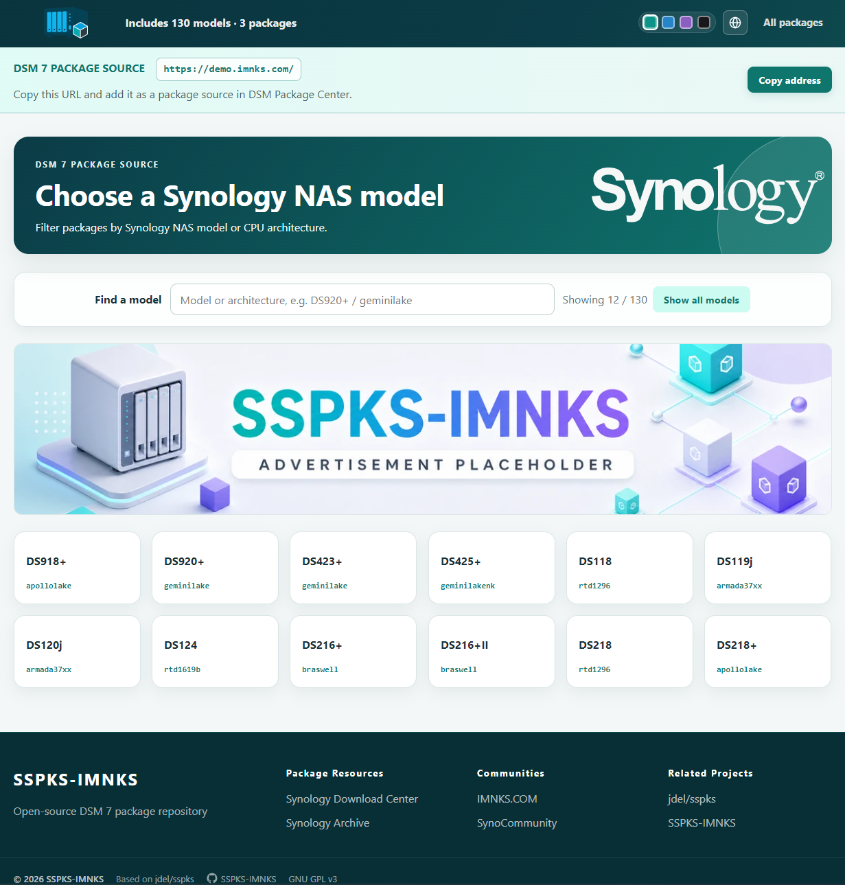

# SSPKS-IMNKS

[English](README.en.md) | 简体中文

面向 Synology DSM 7 的多语言自建 SPK 套件源，衍生自 [jdel/sspks](https://github.com/jdel/sspks)。支持 21 种界面语言、机型/架构筛选、普通与官方 keytype 3 SPK、增量索引及断点恢复。

[作者维护的站点](https://spk7.imnks.com/)




## 功能概览

- 21 种界面语言，跟随浏览器或使用配置语言，支持手动切换与 Cookie 记忆。
- Material 响应式界面、四套配色、机型搜索、优先机型与渐进加载套件卡片。
- 按机型、架构、DSM 版本及稳定/测试渠道筛选套件，支持套件多语言名称与说明。
- 普通 TAR SPK 与官方 keytype 3 加密 SPK 解析，显示官方标识及运行环境标识。
- SQLite 或 MySQL/MariaDB 索引；增量复用 MD5、分段完整校验、实时进度和任务恢复。
- 网页图片转换、可选网页下载及地址混淆，可配置页脚和广告轮播。

简体中文与英文直接维护，其余语言由 AI 翻译，欢迎提交措辞改进。

## 1. 准备环境

- PHP 8.4 或更高版本，搭配 PHP-FPM。
- 扩展：json、pdo、pdo_sqlite、pdo_mysql、phar、sodium、mbstring；图片转换使用支持 WebP 的 GD 或 Imagick。
- PHP 对 cache/、runtime/ 有写权限。即使主索引使用 MySQL，任务恢复仍需要 pdo_sqlite。

发布包包含 vendor/，无需重新安装依赖。

## 2. 部署并配置

1. 下载 Release 中的发布 ZIP，解压到网站目录。
2. 编辑 conf/sspks.yaml：将 site.base_url 改为公开网址，设置不易猜测的 update.action。需要网页下载时，将 browser_download.enabled 设为 true。
3. 编辑 conf/database.yaml：设置 management_password；默认使用 SQLite，自动创建表。使用 MySQL/MariaDB 时填写数据库信息并导入 wd_spk2.sql，表前缀与配置保持一致。
4. 设置下方 Nginx 路由与访问限制，更换域名、网站目录、PHP-FPM Socket 和下载 alias。启用 HTTPS，执行 nginx -t 后重载。
5. 将 robots.txt 中的 Sitemap 改为实际网址。

语言默认跟随浏览器，可用 language.fixed 设置默认语言（如 chs、enu），language.show_selector 控制切换菜单。其他界面选项见 conf/sspks.yaml 注释。


### 常用配置

网站设置位于 conf/sspks.yaml，数据库与管理密码位于 conf/database.yaml。

| 配置 | 用途 |
| --- | --- |
| site.name / site.base_url | 网站名称与公开网址，网址保留末尾斜杠 |
| update.action | 索引管理入口，3–128 位字母、数字、点、下划线或连字符 |
| language.fixed / language.show_selector | 默认语言与语言切换菜单 |
| paths.packages | SPK 存放目录，默认 packages/ |
| appearance.default_palette | 默认配色：teal、ocean、violet、dark |
| appearance.show_runtime_badges | 是否显示 Docker、PHP、Python 等标识 |
| models.show_all_by_default / models.priority_models | 首屏机型展示与优先机型 |
| browser_download.enabled | 允许网页下载；不影响 DSM 套件中心下载 |
| browser_url_obfuscation | 图片与网页 SPK 下载地址混淆 |
| advertisement / footer | 广告轮播与页脚链接 |

语言代码：chs、cht、csy、dan、enu、fre、ger、hun、ita、jpn、krn、nld、nor、plk、ptb、ptg、rus、spn、sve、tha、trk。language.fixed 留空时自动识别；配置固定语言并关闭选择器时强制使用该语言。

网页 SPK 地址混淆依赖 Nginx 内部下载位置；修改套件目录时，应同时修改 paths.packages 与 alias。默认关闭网页下载，DSM 套件中心仍可使用。

## 3. 添加套件并更新索引

1. 将 DSM 7 .spk 文件放入 packages/，或 paths.packages 配置的目录。
2. 打开 https://您的域名/?action=配置的值，输入管理密码，点击“更新索引”。
3. 更新完成后检查网页套件列表。
4. 在 DSM“套件中心 → 设置 → 套件来源 → 新增”中填写名称与站点公开网址。

日常更新仅处理新增或变化的 SPK，按大小和修改时间复用未变化文件的 MD5；修改 cache/ 中对应 .nfo 后，同样点击“更新索引”更新元数据。“完整校验”重新计算全部 MD5。任务分批执行，关闭页面后可再次输入密码继续；解析失败或套件目录为空时保留已有索引。

套件中心响应按机型/架构、DSM 基础版本构建号、语言与更新渠道缓存，不区分 Update 补丁序号；一小时有效，索引完成后清理。


成功数包含新增、变更和未变化，删除单独计数；总计是扫描到的 SPK 数。每个套件独立写入，已经完成的记录先行生效。若文件内容改变但大小和修改时间相同，请使用“完整校验”。

提取文件使用 SPK 文件名，.nfo 为元数据，.source 为失效依据，向导标记与图片另存；通常无需编辑 .source。缓存保留最多 4096 个套件中心响应槽，关注 runtime/cache 的磁盘占用。

## 4. Nginx 配置

以下示例部署在域名根目录。公开 cache/ 仅允许图片；内部下载 alias 必须对应套件目录，且保留 internal。CDN 应保留更新接口的 JSON 错误响应，不缓存管理请求。

```nginx
server {
    listen 80;
    server_name packages.example.com;
    root /var/www/sspks-imnks;
    index index.php;

    location / {
        try_files $uri $uri/ /index.php?$query_string;
    }

    location = /index.php {
        include fastcgi_params;
        fastcgi_param SCRIPT_FILENAME $document_root/index.php;
        fastcgi_param HTTP_AUTHORIZATION $http_authorization;
        fastcgi_intercept_errors off;
        fastcgi_pass unix:/run/php/php8.4-fpm.sock;
    }

    location ~ \.php$ {
        return 404;
    }

    location ^~ /_sspks_download/ {
        internal;
        alias /var/www/sspks-imnks/packages/;
        default_type application/octet-stream;
    }

    location ~ ^/(?:conf|languages|lib|runtime|vendor)(?:/|$) {
        deny all;
    }

    location ~* \.(?:ya?ml|sql|sqlite3?|log|lock|mustache)$ {
        deny all;
    }

    location ~ /\.(?!well-known(?:/|$)) {
        deny all;
    }

    location = /composer.json {
        deny all;
    }

    location ^~ /packages/ {
        autoindex off;
        try_files $uri =404;
        types { application/octet-stream spk; }
    }

    location ^~ /cache/ {
        if ($uri !~* \.(?:png|webp)$) { return 404; }
        autoindex off;
        try_files $uri =404;
        add_header X-Content-Type-Options nosniff always;
    }

    client_max_body_size 16m;
}
```

部署到子目录时，相应调整 site.base_url、Nginx location 和 alias。

## 5. 升级与维护

- 备份配置、索引数据库及手工编辑的 .nfo。
- 更新程序时保留 conf/、套件目录、cache/ 和 runtime/，随后更新索引。解析器或 SPK 改变可能重新生成 .nfo。
- runtime/ 保存数据库和任务，cache/ 保存提取内容；不要公开配置、源码、日志及缓存元数据，定期关注磁盘空间。
- 官方加密 SPK 需要 sodium，目前支持 keytype 3；其他历史或未来格式可能不支持。
- 下载计数目前为占位值，并非实际下载量。


## 常见问题

- **密码错误或限流：** 检查 management_password 或 SSPKS_UPDATE_TOKEN 环境变量。错误密码返回 401；连续失败触发 429 后等待一分钟，认证失败不会开始索引任务。
- **更新中断：** 重新打开原入口并输入密码，可继续未完成任务。确保 runtime/ 可写、pdo_sqlite 已启用；CDN 不要替换错误响应为 HTML。
- **套件未显示：** 确认路径、.spk 文件、索引结果、架构和 DSM 最低版本要求；解析错误查看服务器日志。
- **图片或下载失败：** 检查 cache/ 写权限、图片扩展、内部下载 alias 与实际套件目录。浏览器下载开关不影响 DSM 下载。

## 许可

基于 [jdel/sspks](https://github.com/jdel/sspks)，使用 [GNU GPL v3](LICENSE)。第三方 SPK 遵循各自许可证。
