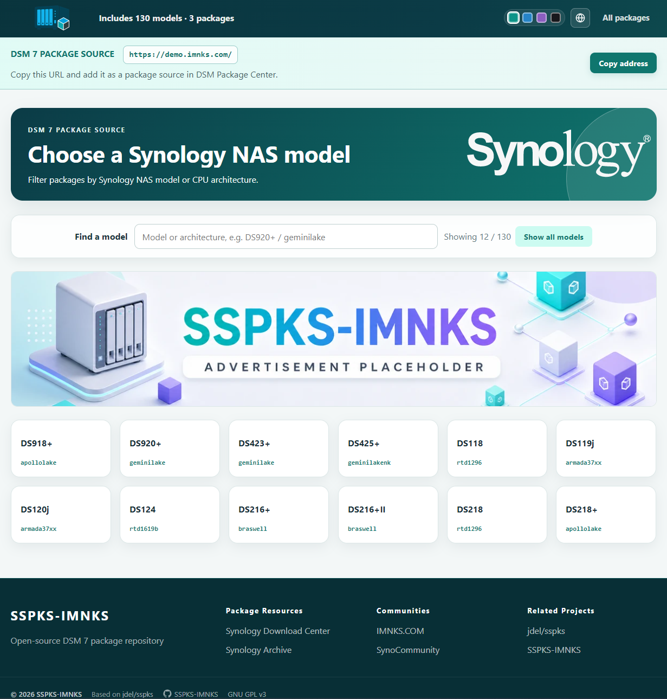

# SSPKS-IMNKS

[English](README.md) | [简体中文](README.zh-CN.md)

SSPKS-IMNKS 是一个面向 Synology DSM 7 的多语言自建 SPK 套件源，衍生自 [jdel/sspks](https://github.com/jdel/sspks)。

**原始站点：** 访问 [spk7.imnks.com](https://spk7.imnks.com/) 查看项目作者维护的 SSPKS-IMNKS 实际运行站点。



## 版本特色

- 21 种完整界面语言，支持浏览器识别、固定首次默认语言和 Cookie 记忆切换结果。
- 简体中文和英文由项目直接维护，其余语言由 AI 翻译，可能仍需母语使用者审校。
- 同时支持 MySQL/MariaDB 与 SQLite3。演示配置默认使用 SQLite；只有几百个套件时通常更简单合适。
- Material 响应式界面，包含 4 套配色、机型搜索、优先机型、套件卡片渐进加载、运行环境标识、Synology 标志、可配置页脚和广告轮播。
- DSM 7 元数据校验、安全读取 SPK 归档、机型/架构筛选和多语言套件说明。
- 索引更新每处理 50 个套件保存检查点，MD5 使用 8 MiB 流式分块读取，可在连接中断后继续。
- MySQL/MariaDB 和 SQLite 均以事务替换索引，写入失败时保留原索引。
- 自动生成 WebP 网页缩略图，可选混淆图片和 SPK 下载地址。

## 环境要求

- PHP 7.4 或更高版本
- PHP 扩展：`json`、`pdo`、`phar`，以及 `pdo_sqlite` 和/或 `pdo_mysql`
- PHP-FPM 或同类 PHP Web 环境
- PHP 对 `cache/`、`runtime/` 具有写权限

仓库内的 `vendor/` 已使用 PHP 7.4 拉取，可直接用于 PHP 7.4。其他 PHP 版本请在对应环境重新执行：

```bash
composer install --no-dev --classmap-authoritative --no-interaction
```

## 快速部署

1. 将项目复制到网站目录。
2. 修改 `conf/sspks.yaml` 和 `conf/database.yaml`。
3. 上线前更换演示网址、管理密码和数据库密码。
4. 将 DSM 7 `.spk` 文件放入 `packages/`。
5. 赋予 PHP 对 `cache/`、`runtime/` 的写权限。
6. 修改 `update.action`，访问 `/?action={配置值}`，输入管理密码更新索引。

SQLite 会自动创建表结构；MySQL/MariaDB 请导入 `wd_spk2.sql`。`wd_spk2.sqlite.sql` 是 SQLite 表结构参考。

## 推荐的 Nginx 配置

项目已经包含自己的 404 页面，因此 Nginx 应把不存在的文件交给 `index.php`，真实静态资源仍由 Nginx 直接提供。下面的示例同时保护配置、源码、依赖和运行数据，并提供浏览器 SPK 地址混淆所需的内部下载位置。

```nginx
server {
    listen 80;
    server_name packages.example.com;
    root /var/www/sspks-imnks;
    index index.php;

    # 真实文件直接返回；未知地址交给程序路由并显示项目自带的 404 页面。
    location / {
        try_files $uri $uri/ /index.php?$query_string;
    }

    # 只允许入口文件执行 PHP。
    location = /index.php {
        include fastcgi_params;
        fastcgi_param SCRIPT_FILENAME $document_root/index.php;
        fastcgi_param HTTP_AUTHORIZATION $http_authorization;
        fastcgi_pass unix:/run/php/php7.4-fpm.sock;
    }

    location ~ \.php$ {
        return 404;
    }

    # 浏览器下载地址混淆使用 X-Accel-Redirect；必须保持 internal。
    # alias 要与 conf/sspks.yaml 中的 paths.packages 对应。
    location ^~ /_sspks_download/ {
        internal;
        alias /var/www/sspks-imnks/packages/;
        default_type application/octet-stream;
    }

    # 禁止公开访问配置、源码、依赖和运行数据。
    location ~ ^/(?:conf|languages|lib|runtime|vendor)(?:/|$) {
        deny all;
    }

    location ~* \.(?:ya?ml|sql|sqlite3?|log|lock|mustache)$ {
        deny all;
    }

    location ~ /\.(?!well-known(?:/|$)) {
        deny all;
    }

    location = /composer.json {
        deny all;
    }

    # DSM 套件中心需要访问 SPK 文件，因此不要封锁 packages 目录，只关闭目录列表。
    location ^~ /packages/ {
        autoindex off;
        try_files $uri =404;
        types { application/octet-stream spk; }
    }

    client_max_body_size 16m;
}
```

请按服务器实际情况修改域名、项目目录、PHP-FPM Socket 和套件目录 alias。如果项目部署在域名的子目录，还要同步调整 `site.base_url` 和对应的 Nginx location。重载前先执行 `nginx -t`。不要使用 `error_page 404 /index.php`；这里的 `try_files` 能让程序正确识别路由并显示项目自带的 404 页面。

## 重要配置

### 语言

`conf/sspks.yaml` 中的 `language.fixed` 决定首次访问语言；留空时根据浏览器语言自动选择，无法匹配则使用英文。`language.show_selector: true` 时允许访客切换并用 Cookie 记住；设为 `false` 时隐藏选择器并强制使用配置语言。

支持：`chs`、`cht`、`csy`、`dan`、`enu`、`fre`、`ger`、`hun`、`ita`、`jpn`、`krn`、`nld`、`nor`、`plk`、`ptb`、`ptg`、`rus`、`spn`、`sve`、`tha`、`trk`。

### 网站地址与 robots.txt

演示配置统一使用 `https://packages.example.com/`。正式部署前，请在 `conf/sspks.yaml` 替换为您的公开网址，同时将 `robots.txt` 的 `Sitemap` 改成真实域名。保留示例值不会泄露个人网站，但搜索引擎也无法发现正确的站点地图。

### 私有索引更新参数

在 `conf/sspks.yaml` 设置不易猜测的 `update.action`，然后访问 `https://您的域名/?action={配置值}` 更新索引。该值必须为 3–128 位，只能包含字母、数字、点、下划线和连字符，系统仅接受配置值。自定义参数可减少管理页被常规扫描发现的机会，管理密码和认证频率限制仍是主要防护。

### 数据库选择

SQLite 无需单独运行数据库服务，数据集中在一个已被 Git 忽略的运行时文件中，维护和暴露面更小，适合中小型套件源。需要远程数据库、集中备份监控或更高并发时，可选择 MySQL/MariaDB。

## 下载计数尚未完成

下载计数目前只是演示值：

- `download_count`：`2026`
- `recent_download_count`：`0`

初始值位于 `lib/SSpkS/Output/JsonOutput.php` 的 `packageToJson()`。它们不会写入数据库、不会在下载后增加，也没有访客去重或时间窗口统计。若需更换占位数字，请直接修改这两个值，不要将其当作真实下载量。

## 安全检查

- 更换全部示例网址与密码。
- 禁止通过 HTTP 直接访问 `conf/`、`lib/`、`vendor/`、`runtime/` 和模板源码。
- SQLite 数据库与更新检查点保存在 `runtime/`；这些文件已被 `.gitignore` 排除。
- 不要把 MySQL/MariaDB 直接暴露到公网。
- 发布第三方 SPK 前检查来源、安全性及其许可证。
- 不要提交缓存、数据库、日志、`.env` 和 `.spk` 文件。

## 相比上游 jdel/sspks

| 项目 | jdel/sspks 上游 | SSPKS-IMNKS |
| --- | --- | --- |
| 目标 | 通用 SSPKS 基础 | 面向 DSM 7 的校验与展示 |
| 数据库 | 不使用数据库，直接从文件读取套件信息 | MySQL/MariaDB 与 SQLite3 索引后端 |
| 多语言 | 上游语言方案 | 21 种界面语言与记忆切换；非中英文由 AI 翻译 |
| 界面 | 原版主题 | Material 响应式界面、配色、机型工具、广告、可配置页脚 |
| 索引更新 | 标准索引流程 | 流式校验、实时进度、检查点与断点继续 |
| 网页资源 | 直接使用套件资源 | WebP 缩略图与可选地址混淆 |
| PHP 7.4 | 需要 Composer 安装 | 已包含 PHP 7.4 生成的 `vendor/` |

本项目是衍生版本，不是可直接覆盖上游的补丁集。替换现有部署前请检查配置与数据库迁移要求。

## 许可与致谢

本项目衍生自 [jdel/sspks](https://github.com/jdel/sspks)，以 [GNU GPL v3](LICENSE)（`GPL-3.0-only`）发布。第三方 SPK 套件仍遵循各自许可证。
